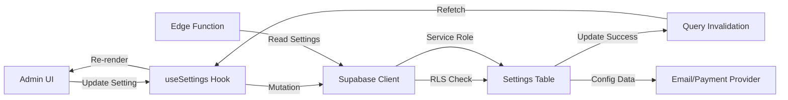

# Settings Module Documentation - PingPe Admin

**Version:** 1.3.1  
**Last Updated:** 2025-11-11

---

## 📋 Overview

The PingPe Settings Module provides a centralized configuration interface for platform administrators to manage email, payments, notifications, roles, and platform settings. All settings are stored in the `settings` table with RLS policies restricting access to admin users only.

---

## 🏗️ Architecture

### Settings Structure

```
/admin/settings
├── Platform Settings    - General platform configuration
├── Payments            - Payment provider configuration (Wise, PayPal, Stripe)
├── Email               - Email provider configuration (Hostinger SMTP)
├── Notifications       - Notification preferences and channels
└── Roles & Permissions - User role management
```

### Database Schema

```sql
CREATE TABLE settings (
  key text PRIMARY KEY,
  value jsonb NOT NULL,
  description text,
  updated_at timestamptz DEFAULT now(),
  updated_by uuid REFERENCES auth.users(id)
);

-- Enable RLS
ALTER TABLE settings ENABLE ROW LEVEL SECURITY;

-- Admin-only access
CREATE POLICY "Admins can manage settings"
  ON settings FOR ALL
  USING (has_role(auth.uid(), 'admin'));
```

---

## 📧 Email Settings (Hostinger SMTP Only)

### Configuration Overview

PingPe uses **Hostinger SMTP exclusively** for email delivery. Resend integration has been removed to simplify the email architecture and reduce configuration complexity.

### Settings Keys

| Key | Type | Description |
|-----|------|-------------|
| `email_hostinger_enabled` | boolean | Master switch for email functionality |
| `email_hostinger_host` | string | SMTP host (default: `smtp.hostinger.com`) |
| `email_hostinger_port` | integer | SMTP port (465 for SSL, 587 for TLS) |
| `email_hostinger_username` | string | Full email address for SMTP auth |
| `email_hostinger_password` | string | Email account password (encrypted) |
| `email_hostinger_from_email` | string | Sender email address |
| `email_hostinger_from_name` | string | Sender display name |

### Configuration Steps

1. **Navigate to Settings**
   - `/admin/settings` → Email tab

2. **Enable Hostinger SMTP**
   - Toggle "Enable Hostinger SMTP" switch
   - This activates all email functionality

3. **Configure SMTP Credentials**
   ```
   SMTP Host: smtp.hostinger.com
   SMTP Port: 465 (SSL recommended)
   Username: your-email@domain.com
   Password: [your-password]
   ```

4. **Set Sender Information**
   ```
   From Email: noreply@yourdomain.com
   From Name: Jungle Resort PingPe
   Reply-To: support@yourdomain.com (optional)
   ```

5. **Save & Test**
   - Click "Save Configuration"
   - Click "Send Test Email"
   - Verify test email received

### Toggle Persistence Fix (v1.3.1)

**Issue:** The "Enable Hostinger SMTP" toggle didn't persist after page refresh.

**Root Cause:** Form state wasn't re-syncing with database after mutation.

**Solution:** Added settings data to `useEffect` dependency array:

```typescript
useEffect(() => {
  // Load settings into form
  const enabled = getSetting("email_hostinger_enabled");
  if (enabled !== undefined) form.setValue("enabled", enabled.value);
  // ... load other fields
}, [getSetting, form]); // Now re-syncs when settings change
```

### Troubleshooting

#### Toggle Doesn't Stay ON/OFF
- ✅ Clear browser cache and refresh
- ✅ Check browser console for errors
- ✅ Verify settings are saved:
  ```sql
  SELECT * FROM settings WHERE key = 'email_hostinger_enabled';
  ```

#### Test Email Fails
- ✅ Verify all required fields are filled
- ✅ Check SMTP credentials are correct
- ✅ Confirm port 465 is not blocked by firewall
- ✅ Try alternate port 587 (TLS)
- ✅ Check Edge Function logs for detailed errors

---

## 💳 Payment Settings

### Supported Providers

1. **Wise (Bank Transfer)** - Primary payment method
2. **PayPal** - Alternative payment method
3. **Stripe** - Credit card payments (planned)

### Configuration Keys

Each provider has similar settings structure:

```typescript
// Wise
payment_wise_enabled: boolean
payment_wise_api_key: string (encrypted)
payment_wise_account_id: string

// PayPal
payment_paypal_enabled: boolean
payment_paypal_client_id: string
payment_paypal_secret: string (encrypted)
payment_paypal_mode: 'sandbox' | 'production'

// Stripe (future)
payment_stripe_enabled: boolean
payment_stripe_publishable_key: string
payment_stripe_secret_key: string (encrypted)
```

---

## 🔔 Notification Settings

### Channels

- **Email** - Booking confirmations, payment receipts
- **SMS** (planned) - Urgent notifications
- **Push** (planned) - Mobile app notifications

### Notification Types

| Type | Description | Default |
|------|-------------|---------|
| `booking_confirmation` | Sent when booking is confirmed | Enabled |
| `payment_received` | Sent when payment is processed | Enabled |
| `booking_reminder` | Sent 24h before check-in | Enabled |
| `booking_cancelled` | Sent when booking is cancelled | Enabled |

---

## 👥 Role Settings

### Available Roles

| Role | Permissions |
|------|-------------|
| `admin` | Full system access, settings management |
| `host` | Create/manage properties, view bookings |
| `guest` | Book experiences, view own bookings |
| `partner` | View commission reports (planned) |

### Role Management

- Admins can assign roles via Settings → Roles & Permissions
- New users automatically get `guest` role
- Role changes take effect immediately

---

## 🔒 Security Best Practices

### Password Storage
- All sensitive credentials encrypted in database
- Never expose passwords in logs or client-side code
- Rotate SMTP/API passwords quarterly

### Access Control
- Settings accessible only to admin role
- RLS policies enforce row-level security
- Audit trail tracks who updated what setting

### Monitoring
- Review Edge Function logs weekly
- Monitor failed email/payment attempts
- Set up alerts for configuration changes

---

## 🧪 Testing

### Email Configuration Test
```typescript
// Via Admin UI
1. Navigate to Settings → Email
2. Click "Send Test Email"
3. Check inbox for test message

// Via Edge Function
const { data } = await supabase.functions.invoke('test-email-v2', {
  body: { to: 'test@example.com' }
});
```

### Payment Configuration Test
```typescript
// Test Wise connection
const { data } = await supabase.functions.invoke('test-wise-connection', {
  body: { amount: 1.00 }
});
```

---

## 📊 Settings Data Flow



---

## 🚀 Future Enhancements

### Planned Features
- [ ] Settings export/import (backup/restore)
- [ ] Settings versioning (audit history)
- [ ] Environment-specific configs (dev/staging/prod)
- [ ] Settings validation rules
- [ ] Real-time settings sync across tabs
- [ ] Settings search/filter in admin UI

---

## 📚 Related Documentation

- [Email System](./email.md)
- [Payment Integration](./payments.md)
- [Admin Guide](./admin-guide.md)
- [Security Best Practices](./security.md)

---

**Last Updated:** 2025-11-11  
**Maintained by:** Devmart Suriname
